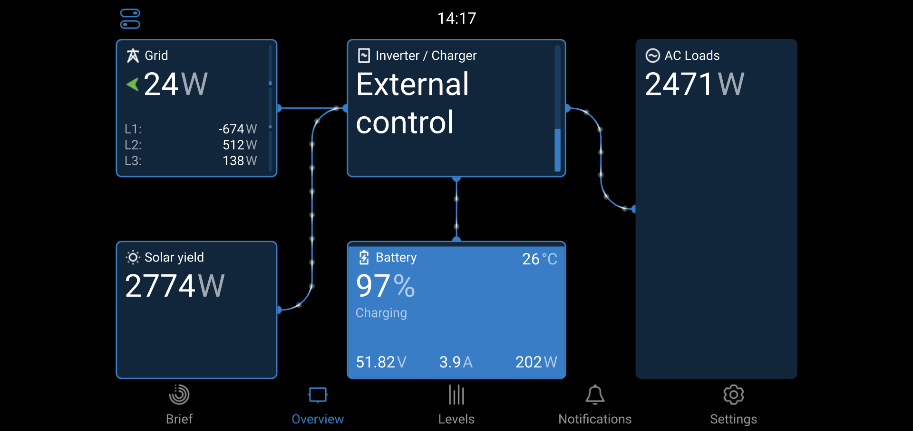
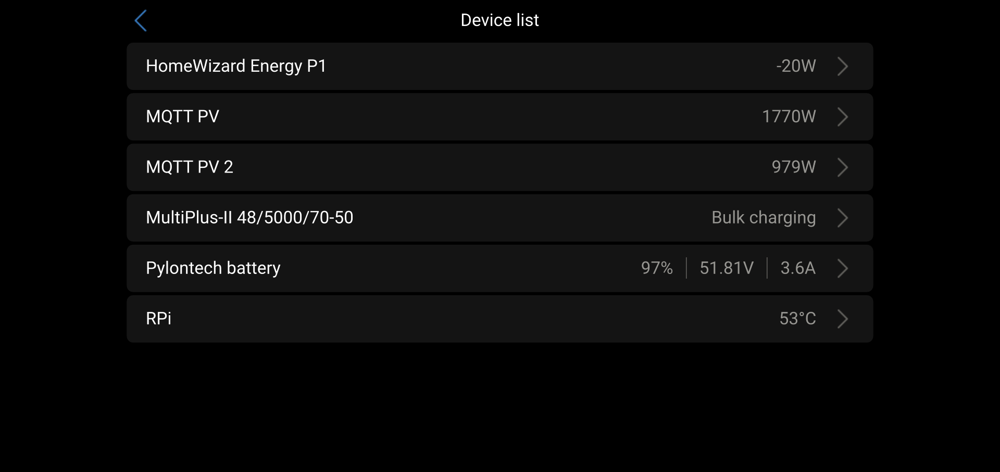
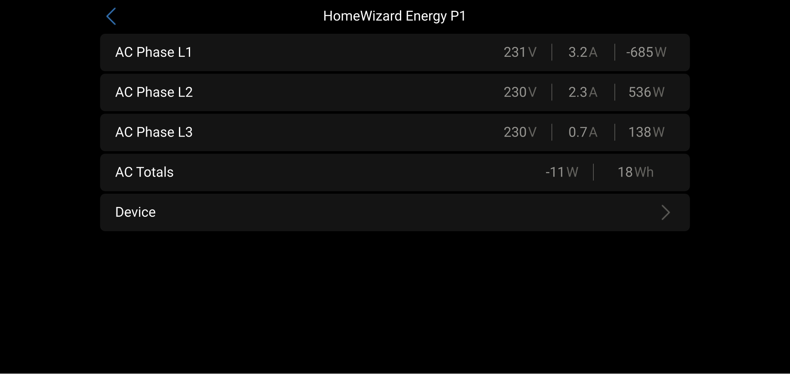
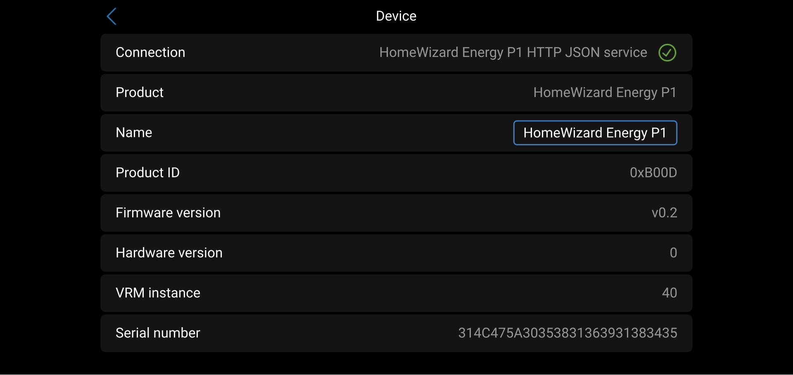

# dbus-homewizard-energy-p1
Integrate HomeWizard Energy P1 meter into [Victron Energies Venus OS](https://github.com/victronenergy/venus)

## Purpose
With the scripts in this repo you can install, uninstall and restart a service that connects the HomeWizard Energy P1 to the VenusOS and GX devices from Victron.

## Inspiration
Forked from https://github.com/back2basic/dbus-Home-Wizzard-Energy-P1. Also used a lot of code from https://github.com/mr-manuel/venus-os_dbus-mqtt-grid.

## How it works
### My setup
- ([HomeWizard Energy P1](https://www.homewizard.com/nl-be/wi-fi-p1-meter))
  - 3-phase installation
  - Connected to Wifi network
  - IP 192.168.1.42
- Raspberry Pi W Zero W with Venus OS - Firmware v3.55
  - Connected to Wifi network
  - IP 192.168.1.60

### Details / Process
The script runs as a service and connects to and publishes data on the dbus of VenusOS. The data is collected from the HomeWizard Energy P1 dongle using the REST API (v1) by calling http://[ip]/api/v1/data. A sample JSON file from HomeWizard Energy P1 can be found [here](docs/homewizard-energy-p1.json).

### Pictures






## Install / Update
1. Login to your Venus OS device via SSH. See [Venus OS: Root Access](https://www.victronenergy.com/live/ccgx:root_access) for more details.

2. Execute this commands to download and copy the files:

```
wget -O /tmp/download_dbus-homewizard-energy-p1.sh https://raw.githubusercontent.com/tomvanacker85/dbus-homewizard-energy-p1/master/download.sh
bash /tmp/download_dbus-homewizard-energy-p1.sh
```

### Extra steps for your first installation
3. Edit the config file to fit your needs. The correct command for your installation is shown after the installation.

```nano /data/etc/dbus-mqtt-grid/config.ini```

4. Install the driver as a service. The correct command for your installation is shown after the installation.

  ```bash /data/etc/dbus-mqtt-grid/install.sh```
The daemon-tools should start this service automatically within seconds.

## Config
Copy or rename the config.sample.ini to config.ini in the ``/data/etc/dbus-mqtt-grid/`` folder and change it as you need it.

| Section  | Config vlaue | Explanation |
| ------------- | ------------- | ------------- |
| DEFAULT  | AccessType | Fixed value 'OnPremise' |
| DEFAULT  | SignOfLifeLog  | Time in minutes how often a status is added to the log-file `current.log` with log-level INFO |
| DEFAULT  | CustomName  | Name of your device - usefull if you want to run multiple versions of the script |
| DEFAULT  | DeviceInstance  | DeviceInstanceNumber e.g. 40 |
| DEFAULT  | Role | Fixed value:  'GRID' |
| DEFAULT  | Position | Fixed value: 0 = AC|
| DEFAULT  | LogLevel  | Define the level of logging - lookup: https://docs.python.org/3/library/logging.html#levels |
| DEFAULT  | Phases  | 1 for 1 phase system / 3 for 3 phase system |
| ONPREMISE  | Host | IP or hostname of on-premise HomeWizard Energy P1 web-interface |

## Uninstall
To uninstall the service:

```bash /data/etc/dbus-mqtt-grid/uninstall.sh```

## Restart
To restart the service:

```bash /data/etc/dbus-mqtt-grid/restart.sh```

## Debugging
To check the logs of the default instance:
```
tail -n 100 -F /data/log/dbus-homewizard-energy-p1/current | tai64nlocal
```

The service status can be checked with svstat: 

```svstat /service/homewizard-energy-p1```

This will output somethink like ``/service/dbus-homewizard-energy-p1: up (pid 26270) 1133 seconds``.

If the seconds are under 5 then the service crashes and gets restarted all the time. If you do not see anything in the logs you can increase the log level in ``/data/etc/dbus-homewizard-energy-p1/config.ini`` by changing ``level=logging.WARNING`` to ``level=logging.INFO`` or ``level=logging.DEBUG`` and restarting the service. For available log values: see https://docs.python.org/3/library/logging.html#levels.

If the script stops with the message ``dbus.exceptions.NameExistsException: Bus name already exists: com.victronenergy.grid.homewizard_energy_p1`` it means that the service is still running or another service is using that bus name.

## Compatibility
This software supports the latest three stable versions of Venus OS. It may also work on older versions, but this is not guaranteed.


## Used documentation
- https://github.com/victronenergy/venus/wiki/dbus#grid   DBus paths for Victron namespace GRID
- https://github.com/victronenergy/venus/wiki/dbus#pv-inverters   DBus paths for Victron namespace PVINVERTER
- https://github.com/victronenergy/venus/wiki/dbus-api   DBus API from Victron
- https://www.victronenergy.com/live/ccgx:root_access   How to get root access on GX device/Venus OS
